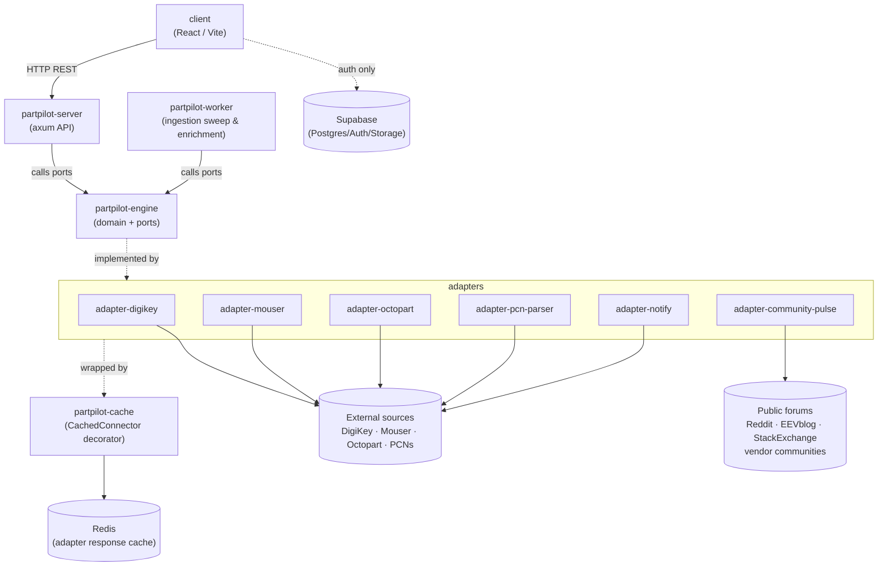

# PartPilot

Electronic component obsolescence intelligence platform.

**Stack**: Rust (engine/server/worker), React (client), Supabase (Postgres + Auth + Storage), Redis (adapter response cache), Railway (hosting), Python (KiCad plugin). Single monorepo, Cargo workspace for the Rust side.

## Components



### 1. client

The React frontend (Vite). Everything the user actually sees and clicks — Dashboard, Part Search, Projects/BOM tabs, all built from the shared DataTable, ScoreRing, and other reusable UI components.

The client talks to partpilot-server over HTTP and directly to Supabase only for authentication and session management.

It contains no business logic. Reconciliation, risk scoring, and BOM diffing all happen server-side; the client simply renders the results.

## Database Migrations

Database migrations use the Supabase CLI and live in `supabase/migrations/`.

To apply migrations to a linked Supabase project:

```bash
supabase login
supabase link --project-ref <project-ref>
supabase db push
```

To apply migrations with a database connection string instead of linking:

```bash
supabase db push --db-url <db_connection_string>
```

To create a new migration:

```bash
supabase migration new <migration_name>
```

For Supabase GitHub integration, set the working directory to `.` because the `supabase/` directory is at the repository root. Supabase automatically runs new files in `supabase/migrations/` for preview branches and production deployments when that integration is enabled.

### 2. adapters

The outward-facing edges of the system — one crate per external integration:

* adapter-digikey
* adapter-mouser
* adapter-octopart
* adapter-pcn-parser
* adapter-notify
* adapter-community-pulse

Each adapter implements a trait defined in partpilot-engine such as:

* DataSourceConnector
* PartRepository
* NotificationSender

Adapters translate between external APIs, authentication methods, and response formats and the engine's clean domain models.

This is where all source-specific complexity lives:

* Rate limiting
* OAuth flows
* PDF parsing
* API quirks
* Vendor-specific data mapping

Keeping these concerns isolated prevents them from leaking into the rest of the system.

**Community Pulse** is the component that collects and summarizes what engineers actually say about a part across public forums — the same idea as Reddit Answers, applied to component reputation. It pulls in mentions, then hands them to the engine for ranking and synthesis into a short, cited summary (common praise, common issues, overall sentiment) shown alongside a part's lifecycle and risk data.

Credible sources this adapter draws from:

* Reddit (r/AskElectronics, r/PrintedCircuitBoard, r/embedded)
* EEVblog forum
* Electrical Engineering Stack Exchange
* ST Community (STMicroelectronics)
* Renesas Engineering Community
* Silicon Labs Community
* TI E2E (Texas Instruments)
* Microchip Forums
* NXP Community
* All About Circuits forums

### Caching layer (`partpilot-cache`)

`partpilot-server` and `partpilot-worker` both call out to the same rate-limited, sometimes-paid external APIs (DigiKey, Mouser, Octopart) — the worker on its daily sweep, the server synchronously in enrich mode when a user searches/uploads a BOM containing a part with no data yet. Without a shared cache, a burst of enrich-mode lookups for the same not-yet-seen part (e.g. several users uploading BOMs that share a part) each re-hit the paid API before the worker ever gets to it.

`partpilot-cache` is a `CachedConnector<T: DataSourceConnector>` decorator — same shape as the existing `RateLimited<T>` wrapper — backed by Redis. It sits *inside* the rate limiter in the composition root (`RateLimited(CachedConnector(inner))`), so cache hits never consume rate-limit budget; only real misses do.

* **Why Redis, not another Postgres table**: the cached data is disposable (re-fetchable from source), wants TTL-based expiry rather than a cleanup job, and needs to be shared between two separate Railway services (server + worker) without adding read/write load to the Postgres instance that holds the actual source of truth.
* **Key shape**: `adapter:{source_id}:{normalized_mpn}:{normalized_manufacturer}` → serialized raw connector response.
* **TTL**: defaults to the sweep cadence (24h) — data can't be fresher than the next scheduled sweep anyway, so caching past that point costs nothing in staleness.
* Client: `deadpool-redis` for pooling, added to both `AppState` (server) and the worker's composition root.

### 3. partpilot-engine

The brain of the system.

Pure business logic with no HTTP server, database driver, or runtime dependencies beyond trait definitions.

Responsibilities include:

* MPN normalization
* Manufacturer normalization
* Lifecycle reconciliation across multiple sources
* Risk scoring
* Alternate part matching
* Ranking and synthesizing forum mentions into Community Pulse summaries

partpilot-engine depends on nothing else in the workspace.

Everything else depends on it.

If Postgres, DigiKey, Reddit, or any other external dependency changed, this crate would remain largely untouched — Community Pulse's ranking/synthesis logic lives here for the same reason reconciliation and risk scoring do: it's judgment the engine owns, while adapter-community-pulse just fetches the raw posts.

### 4. partpilot-server

The API layer.

An Axum-based binary that wires concrete adapters into the engine's traits (the composition root) and exposes HTTP endpoints for:

* Part search
* Part details
* BOM upload
* BOM comparison
* Watchlists
* Authentication
* Error handling

The server intentionally remains thin:

* Receive request
* Call engine and repositories
* Format response
* Return result

Very little business logic lives here.

### 5. partpilot-worker

The background processing service.

A separate binary with no HTTP surface that performs scheduled and asynchronous tasks such as:

* Pulling lifecycle updates from external sources
* Reconciling data
* Recomputing risk scores
* Sending notifications and alerts
* Performing on-demand enrichment for previously unseen parts
* Sweeping forums for fresh mentions and refreshing Community Pulse summaries

It runs as an independent Railway service so that slow, rate-limited, or failure-prone ingestion tasks never block the user-facing API.

## Documentation

- [Implementation plan](docs/implementation.md)
- [ADR-001: Monorepo over polyrepo](docs/architecture-decisions/001-monorepo-over-polyrepo.md)
- [ADR-002: Supabase over plain Postgres on Railway](docs/architecture-decisions/002-supabase-over-plain-postgres-on-railway.md)
