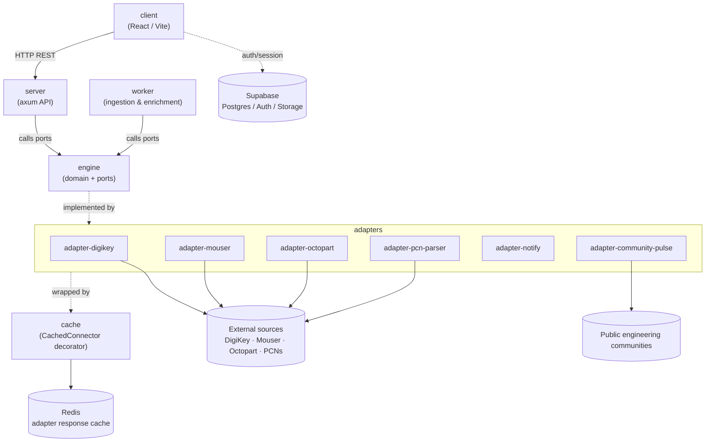

<div align="center">
<picture>
  <source media="(prefers-color-scheme: dark)" srcset="apps/website/public/partpilot-logo-dark-landscape.png" width="960">
  <source media="(prefers-color-scheme: light)" srcset="apps/website/public/partpilot-logo-light-landscape.png" width="960">
  
</picture>

### Component intelligence for hardware teams

Find lifecycle changes, obsolescence risk, PCNs, risky BOM items, and better replacement options before they become production problems.

[Website](https://bestpartpilot.com) · [Architecture](docs/architecture/overview.md) · [API docs](docs/api/api-doc.md) · [Contributing](CONTRIBUTING.md)

</div>

---

## What PartPilot does

A BOM can be technically valid and still contain future production problems.

A component can exist today while quietly becoming NRND, obsolete, difficult to source, affected by a PCN, dependent on a single source, or hard to replace safely.

PartPilot is building an intelligence layer that pulls those signals together and explains what deserves attention.

For a part or BOM, PartPilot is designed to answer questions like:

- Is this component still safe to design in?
- Is it active, NRND, obsolete, or approaching end of life?
- What changed recently?
- Why did this part's risk score move?
- Are there credible alternates?
- What are engineers reporting about this part?
- Which BOM items need investigation first?

## Why this exists

Lifecycle and component-risk information is fragmented across manufacturer pages, distributor APIs, PCNs, datasheets, compliance documents, and engineering communities.

The useful question is not just **"does this part exist?"**

It is:

> **"What could make this part a problem later, and what evidence supports that?"**

PartPilot brings those signals into one system so engineering and sourcing teams can catch problems earlier.

## Current capabilities

- Multi-source component and lifecycle ingestion
- Manufacturer and MPN normalization
- Lifecycle reconciliation
- Component risk scoring
- Alternate-part matching
- BOM upload and comparison
- Watchlists and notifications
- Scheduled enrichment and risk refreshes
- Community Pulse: engineering discussion signals attached to component context
- Shared Redis cache for rate-limited external data sources

## Community Pulse

Datasheets tell you what a component is supposed to do.

Engineers tell you what happens when you actually use it.

Community Pulse collects public engineering discussions and lets the PartPilot engine rank and synthesize those mentions into cited component-level context: common praise, recurring issues, and overall sentiment.

Sources include communities such as:

- Reddit communities including r/AskElectronics, r/PrintedCircuitBoard, and r/embedded
- EEVblog
- Electrical Engineering Stack Exchange
- ST Community
- Renesas Engineering Community
- Silicon Labs Community
- TI E2E
- Microchip Forums
- NXP Community
- All About Circuits

The goal is not to replace manufacturer data. It is to add the field experience that manufacturer data usually does not contain.

## Architecture

PartPilot is a monorepo.

**Stack:** Rust for the engine/server/worker side, React + Vite for the client, Supabase for Postgres/Auth/Storage, Redis for adapter caching, Railway for hosting, and Python for KiCad integration work.


```mermaid
graph TD
    Client["client<br/>(React / Vite)"]
    Server["server<br/>(axum API)"]
    Engine["engine<br/>(domain + ports)"]
    Worker["worker<br/>(ingestion & enrichment)"]

    subgraph Adapters["adapters"]
        DigiKey["adapter-digikey"]
        Mouser["adapter-mouser"]
        Octopart["adapter-octopart"]
        PCN["adapter-pcn-parser"]
        Notify["adapter-notify"]
        CommunityPulse["adapter-community-pulse"]
    end

    Cache["cache<br/>(CachedConnector decorator)"]

    Supabase[("Supabase\nPostgres / Auth / Storage")]
    Redis[("Redis\nadapter response cache")]
    External[("External sources\nDigiKey · Mouser · Octopart · PCNs")]
    Forums[("Public engineering communities")]

    Client -->|HTTP REST| Server
    Server -->|calls ports| Engine
    Worker -->|calls ports| Engine
    Engine -.->|implemented by| Adapters
    Adapters -.->|wrapped by| Cache
    Cache --> Redis

    DigiKey --> External
    Mouser --> External
    Octopart --> External
    PCN --> External
    CommunityPulse --> Forums

    Client -.->|auth/session| Supabase
```

### Engine

The engine owns PartPilot's domain logic and stays independent of HTTP, database drivers, and vendor APIs.

Responsibilities include:

- MPN normalization
- Manufacturer normalization
- Lifecycle reconciliation
- Risk scoring
- Alternate matching
- Community Pulse ranking and synthesis
- Category-aware component metadata validation and reconciliation

External systems implement traits defined by the engine so vendor-specific behavior stays outside the domain layer.

### Adapters

Adapters translate external APIs, authentication schemes, documents, and vendor-specific formats into clean PartPilot domain models.

That is where source-specific concerns live:

- rate limiting
- OAuth
- PDF / PCN parsing
- vendor API quirks
- source-specific mappings

### Server

The Axum API is intentionally thin:

1. receive the request
2. call engine/repository interfaces
3. format the result
4. return the response

### Worker

The worker runs ingestion and enrichment separately from the user-facing API so slow or rate-limited jobs do not block requests.

Typical work includes:

- pulling lifecycle changes
- reconciling sources
- recomputing risk
- sending notifications
- enriching previously unseen parts
- refreshing Community Pulse summaries

### Cache

Server and worker share a Redis-backed connector cache.

The cache sits inside the rate limiter so cache hits do not consume external API quota.

Key shape:

```text
adapter:{source_id}:{normalized_mpn}:{normalized_manufacturer}
```

Default TTL is aligned with the daily sweep cadence.

## Repository layout

```text
apps/
  client/      React product UI
  website/     PartPilot website
  feed/        Rust application

crates/
  engine/      domain logic + ports
  adapters/    external integrations
  server/      Axum API

tools/
  cli/         CLI scaffold / work in progress

docs/          architecture, API, domain, infra, proposals
supabase/      database migrations
```

## Local development

### Requirements

- Rust toolchain
- Node.js 20.19+
- pnpm 12.5.1
- Supabase CLI for local database work

Install JavaScript dependencies:

```bash
pnpm install
```

Run the client:

```bash
pnpm dev:client
```

Run the website:

```bash
pnpm dev:website
```

Build the Rust workspace:

```bash
cargo build --workspace
```

Build web packages:

```bash
pnpm build
```

Copy `.env.example` and configure the services you want to run locally.

## Database migrations

Migrations live in `supabase/migrations/`.

Linked project:

```bash
supabase login
supabase link --project-ref <project-ref>
supabase db push
```

Direct database URL:

```bash
supabase db push --db-url <db_connection_string>
```

Create a migration:

```bash
supabase migration new <migration_name>
```

## DigiKey configuration

The DigiKey adapter uses Product Information v4 with OAuth 2.0 client credentials.

Configure:

```text
DIGIKEY_CLIENT_ID
DIGIKEY_CLIENT_SECRET
DIGIKEY_ACCOUNT_ID
```

Locale defaults to US / en / USD. See `.env.example` for the available locale variables.

## Roadmap

PartPilot is early and moving quickly.

- [x] Component normalization
- [x] Lifecycle reconciliation
- [x] Risk scoring
- [x] BOM upload and comparison
- [x] Scheduled enrichment
- [x] Redis connector caching
- [x] Community Pulse architecture
- [ ] Expand manufacturer / distributor coverage
- [ ] Productionize the PartPilot CLI
- [ ] Deeper KiCad workflow integration
- [ ] Datasheet intelligence and structured metadata extraction
- [ ] Better alternate compatibility reasoning
- [ ] Change-impact analysis across BOM and engineering context
- [ ] Public component-intelligence API workflows

## Contributing

Useful contributions include:

- component and manufacturer adapters
- lifecycle / PCN edge cases
- datasheet parsing
- normalization cases
- KiCad integration
- test BOMs
- component metadata schemas
- engineering-community source connectors
- documentation and developer experience

See [CONTRIBUTING.md](CONTRIBUTING.md).

## Documentation

- [Architecture Overview](docs/architecture/overview.md)
- [Engine](docs/architecture/engine.md)
- [Client](docs/architecture/client.md)
- [Component Metadata and Datasheet Ingestion](docs/domain/component-metadata-ingestion.md)
- [Component Protocols](docs/domain/component-protocols.md)
- [Component CDD Schema](docs/domain/component-cdd.schema.json)
- [Local & Production Setup Guide](docs/infra/local-and-prod-setup.md)
- [PostgreSQL Schema](docs/infra/postgresql-schema.md)
- [API Documentation](docs/api/api-doc.md)
- [Postman Collection](docs/api/server.postman_collection.json)
- [Feature Proposal](docs/proposals/feature-proposal.md)

---

<div align="center">

If component intelligence for hardware should be easier to inspect, explain, and build on, **star the repo and follow the project.**

</div>
