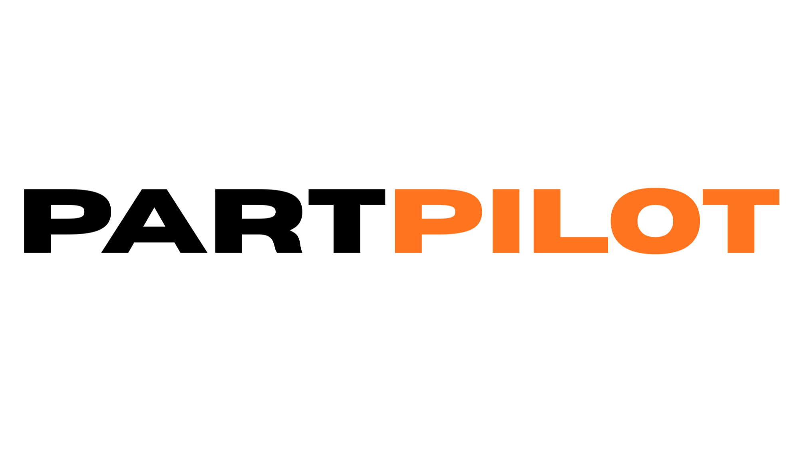

<div align="center">
<picture>
  <source media="(prefers-color-scheme: dark)" srcset="apps/website/public/partpilot-logo-dark-landscape.png">
  <source media="(prefers-color-scheme: light)" srcset="apps/website/public/partpilot-logo-light-landscape.png">
  
</picture>
</div>

# PartPilot

PartPilot helps hardware teams catch component and BOM risks before they become production problems.

It brings lifecycle changes, component metadata, source evidence, alternates, and engineering context into one place so teams can understand **what changed, why it matters, and what needs attention**.

> PartPilot is in active development. Interfaces and behavior may change.

## What this repository is for

This repository is the public PartPilot product and integration surface. It includes the web applications, API/server surface, component data contracts, integrations, and tooling used to connect PartPilot to hardware workflows.

The long-term architecture separates the public integration layer from PartPilot's proprietary decision-intelligence engine. That separation is currently in progress. New proprietary scoring, reasoning, ranking, and change-impact logic should not be added to this public repository.

See [Public / Private Boundary](docs/architecture/public-private-boundary.md).

## Current capabilities

- Search and inspect electronic components
- Upload and analyze BOMs
- Track important parts and component changes
- Normalize component metadata and documentation
- Surface lifecycle and source information
- Compare candidate alternates
- Connect PartPilot to KiCad and external component-data sources

## Repository layout

```text
apps/
  client/       PartPilot application
  website/      Public website

crates/
  server/       HTTP API
  worker/       Background ingestion and enrichment
  adapters/     External data-source integrations
  engine/       Legacy/current engine code pending architectural separation

plugins/
  kicad/        KiCad integration

infra/          Deployment and database infrastructure
docs/           API, domain, architecture, and setup documentation
```

## Development

PartPilot uses Rust for backend services, React/TypeScript for the web applications, Supabase/Postgres for persistence and authentication, Redis for caching, and Python for the KiCad integration.

For local setup and environment configuration, see [Local & Production Setup](docs/infra/local-and-prod-setup.md).

## Documentation

- [Architecture Overview](docs/architecture/overview.md)
- [Public / Private Boundary](docs/architecture/public-private-boundary.md)
- [API Documentation](docs/api/api-doc.md)
- [Component Metadata](docs/domain/component-metadata-ingestion.md)
- [Component CDD Schema](docs/domain/component-cdd.schema.json)
- [Local & Production Setup](docs/infra/local-and-prod-setup.md)
- [PostgreSQL Schema](docs/infra/postgresql-schema.md)

## Contributing

See [CONTRIBUTING.md](CONTRIBUTING.md) before opening a pull request.

## Security

Please do not report security vulnerabilities in public issues. See [SECURITY.md](SECURITY.md).

## License

A software license has not yet been published for this repository. Until one is added, the repository being public should not be interpreted as granting permission to copy, modify, or redistribute the code.
