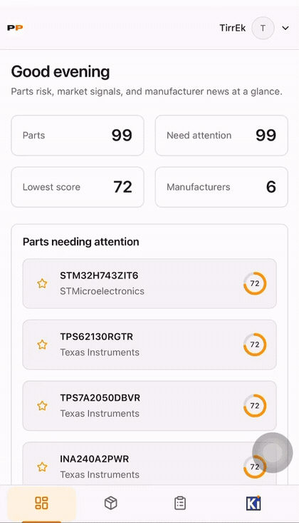

<div align="center">
<picture>
  <source media="(prefers-color-scheme: dark)" srcset="apps/website/public/partpilot-logo-dark-landscape.png">
  <source media="(prefers-color-scheme: light)" srcset="apps/website/public/partpilot-logo-light-landscape.png">
  
</picture>

### Component intelligence for hardware engineering

**Catch risky components before they become production problems.**
</div>

<p align="center">
  
</p>

PartPilot helps hardware teams inspect BOMs and component changes before lifecycle and sourcing problems turn into production surprises.

## What PartPilot does

Hardware teams shouldn't discover component problems after a board is already designed.

PartPilot brings component data and engineering context together to help teams investigate:

- lifecycle, EOL, and NRND risk
- PCNs and manufacturer changes
- supply dependencies
- questionable alternates
- parametric mismatches
- component documentation and compliance
- the impact of component changes

The product is in active development, so interfaces and behavior may change.

## Try PartPilot

The current product can upload and inspect BOMs, search electronic components, surface lifecycle and compliance information, track parts, and investigate candidate alternates.

**Web app:** [app.bestpartpilot.com](https://app.bestpartpilot.com)

A public CLI workflow is planned as part of the open PartPilot developer surface. We won't document commands here until they are actually available.

## Open PartPilot ecosystem

This repository is becoming the public developer and integration layer around PartPilot.

The target public surface includes:

- developer tooling and future CLI
- KiCad and future EDA integrations
- API clients and SDKs
- BOM parsing and import/export tooling
- public schemas and component-data contracts
- examples and test fixtures
- public API documentation

The PartPilot decision-intelligence engine is proprietary.

```text
BOM / KiCad / Web / SDK
          |
          v
    PartPilot API
          |
          v
 Proprietary engine
          |
          v
 evidence + decision
```

The separation is still in progress. The current repository contains legacy/current engine code while dependencies are being removed. New proprietary scoring, reasoning, ranking, and change-impact logic should not be added here.

Read the [public/private architecture boundary](docs/architecture/public-private-boundary.md).

## KiCad

PartPilot is building toward component intelligence inside the tools hardware engineers already use.

The KiCad integration lives in `plugins/kicad/`. As the integration matures, this section will become the fastest path from a board/BOM to PartPilot analysis.

## Component Intelligence Benchmark

We're developing benchmark infrastructure for evaluating how well systems handle real component-intelligence decisions: lifecycle changes, evidence, alternates, constraints, uncertainty, and eventually change impact.

The benchmark will be published when the cases and evaluation criteria are ready. We want it to test real engineering judgment rather than be designed around making PartPilot look good.

## Contributing

We want hardware engineers involved.

Found a weird component case? Have a BOM format we don't support? Think PartPilot made the wrong call? Open an issue or read [CONTRIBUTING.md](CONTRIBUTING.md) before sending a pull request.

Please read the [public/private boundary](docs/architecture/public-private-boundary.md) before contributing architecture or engine-related changes.

## Development

PartPilot currently uses Rust for backend services, React/TypeScript for the web applications, Supabase/Postgres for persistence and authentication, Redis for caching, and Python for the KiCad integration.

Developer details live in the docs instead of the top of this README:

- [Architecture Overview](docs/architecture/overview.md)
- [API Documentation](docs/api/api-doc.md)
- [Component Metadata](docs/domain/component-metadata-ingestion.md)
- [Component CDD Schema](docs/domain/component-cdd.schema.json)
- [Local & Production Setup](docs/infra/local-and-prod-setup.md)
- [PostgreSQL Schema](docs/infra/postgresql-schema.md)

## Security

Please do not report security vulnerabilities in public issues. See [SECURITY.md](SECURITY.md).

## License

A software license has not yet been published for this repository. Until one is added, the repository being public should not be interpreted as granting permission to copy, modify, or redistribute the code.
