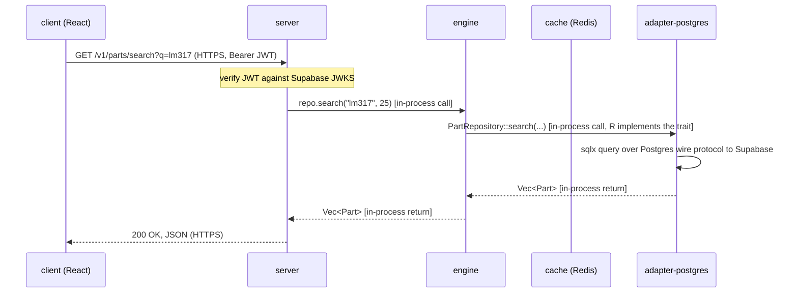
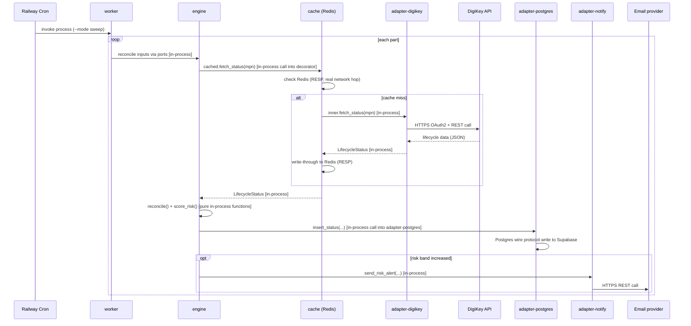

# PartPilot — how components actually talk to each other

The repo has many crates and services, but they don't all talk the same way. The single most important distinction to keep straight:

> **Same binary → function call. Different binary/process → network protocol.**

`server`, `worker`, `engine`, and every `adapter-*` crate are all **Rust libraries compiled into the same executable** at `cargo build` time (two executables, actually — `server` and `worker` each statically link `engine` and whichever adapters they need). There is no network hop, no serialization, no port number between them — calling the engine from the server is exactly as "remote" as calling a function in the same file. The things that genuinely cross a network are `client` ↔ `server`, anything ↔ Supabase, anything ↔ Redis, and adapters ↔ the outside world.

---

## 1. Map of every boundary

| From | To | Same process? | Mechanism | Protocol / format | Auth |
|---|---|---|---|---|---|
| `server` | `engine` | ✅ yes | Rust trait method call (`Arc<dyn PartRepository>` etc., dynamic dispatch) | in-process function call — no wire format | n/a |
| `worker` | `engine` | ✅ yes | same as above | in-process function call | n/a |
| `engine` ports | `adapter-*` crates | ✅ yes | trait implementation — the adapter crate *is* the concrete type behind the `dyn Trait` | in-process function call (the network I/O, if any, happens *inside* the adapter's method body, not at this boundary) | n/a |
| `server` / `worker` | `cache` | ✅ yes | decorator wrapping a `DataSourceConnector` (`CachedConnector<T>`) | in-process — but the decorator's *inner* cache check is a real network call, see row below | n/a |
| `adapter-digikey` | DigiKey API | ❌ no | HTTPS | REST/JSON | OAuth2 client-credentials |
| `adapter-mouser` | Mouser API | ❌ no | HTTPS | REST/JSON | static API key (query param/header) |
| `adapter-octopart` | Nexar/Octopart API | ❌ no | HTTPS | GraphQL/JSON | Bearer token |
| `adapter-pcn-parser` | Manufacturer PCN feeds | ❌ no | HTTPS | RSS/HTML/PDF (parsed, not a structured API) | none — public feeds |
| `adapter-notify` | Email provider (Resend/Postmark) | ❌ no | HTTPS | REST/JSON | API key |
| `adapter-notify` | Webhook targets (Slack/Teams) | ❌ no | HTTPS | REST/JSON (incoming webhook payload) | webhook URL is the secret |
| `adapter-postgres` | Supabase Postgres | ❌ no | TCP + TLS | Postgres wire protocol (via `sqlx`) | connection string (service role, bypasses RLS) |
| `cache` | Redis (Railway) | ❌ no | TCP | RESP (Redis protocol, via `redis-rs`) | `REDIS_URL` |
| `server` | Supabase JWKS endpoint | ❌ no | HTTPS | JSON (JWKS), fetched once and cached in-memory | none (public keys) |
| `client` | `server` | ❌ no | HTTPS | REST/JSON | Supabase session JWT (`Authorization: Bearer`) |
| `client` | Supabase Auth | ❌ no | HTTPS | Supabase JS SDK over REST | user credentials → session JWT |
| `kicad-plugin` | `server` | ❌ no | HTTPS | REST/JSON | long-lived API key (`X-API-Key`) |
| Railway Cron | `worker` | n/a — process trigger, not a network call between two running services | scheduled process invocation | — | Railway platform-level |
| GitHub Actions | Railway | ❌ no | HTTPS (Railway GitHub integration) | deploy webhook | GitHub↔Railway app integration |

---

## 2. In-process boundaries, in detail

### `server` / `worker` → `engine`

At startup, each binary's composition root (`state.rs` in the server, `config.rs`/`main.rs` in the worker) builds concrete adapter instances and stores them behind `Arc<dyn Trait>`:

```rust
let repo: Arc<dyn PartRepository> = Arc::new(PostgresRepository::connect(&db_url).await?);
let digikey: Arc<dyn DataSourceConnector> = Arc::new(DigikeyConnector::new(cfg)?);
```

From that point on, `repo.find_by_mpn(&mpn).await` is a **virtual method call through a vtable** — Rust's dynamic dispatch mechanism for trait objects. It costs a pointer indirection, nothing more. `engine`'s pure functions (`reconcile`, `score_risk`, `normalize_mpn`) aren't even behind a trait — they're called directly, no indirection at all.

The only reason this feels like it should be a network call is that the *shape* (ports and adapters) looks like a microservice boundary. It isn't one — it's a compile-time seam, not a runtime one. Swapping `adapter-postgres` for a different implementation means recompiling and relinking, not redeploying a separate service.

### `engine` ports → `adapter-*` crates

Same mechanism, same direction of dependency as above, just stated from the engine's side: the engine defines `trait DataSourceConnector`, and `adapter-digikey::DigikeyConnector` is one of possibly several types that implement it. The engine never imports `adapter-digikey` (that would invert the dependency direction — see the CI check in `rust-ci.yml` that enforces this). The *server's* composition root is what imports both and wires them together.

### `cache`'s decorator

`CachedConnector<T: DataSourceConnector>` wraps any connector and implements `DataSourceConnector` itself:

```rust
let cached: Arc<dyn DataSourceConnector> = Arc::new(CachedConnector::new(digikey, redis_pool));
```

Calling `cached.fetch_status(...)` is still an in-process call from the caller's point of view — but *inside* that method, `CachedConnector` first does a real network round-trip to Redis (RESP protocol) to check for a cached value, and only calls through to the wrapped `digikey` connector (which does its own real network round-trip to DigiKey) on a cache miss. The decorator pattern is what lets "does this call hit the network" be an implementation detail the rest of the code doesn't need to know about.

---

## 3. Cross-process boundaries, in detail

### `client` ↔ `server`

Plain HTTPS REST, JSON bodies, exactly as documented in `partpilot-api-doc.md`. The client's `api/client.ts` wrapper reads the current Supabase session token and attaches it as `Authorization: Bearer <token>`; `server`'s `auth.rs` middleware verifies that JWT against Supabase's JWKS endpoint (fetched once, cached, refreshed on key rotation) before the request reaches any route handler.

### `client` ↔ Supabase Auth (bypasses the server entirely)

Login, signup, session refresh, and logout go **directly** from the client to Supabase using the Supabase JS SDK — `server` is not in this path at all. This is deliberate: it's simpler and it means the server never handles raw credentials. The server only ever sees the resulting JWT, and only for verification.

### `adapter-*` ↔ external data sources

This is where the actual variety lives, since every source speaks differently:

- **DigiKey**: OAuth2 client-credentials flow gets a bearer token (cached in-memory by `adapter-digikey`, refreshed before expiry); subsequent calls are REST/JSON against DigiKey's Product Details API.
- **Mouser**: a static API key on every request; REST/JSON.
- **Octopart/Nexar**: a single GraphQL endpoint, bearer token auth, batched queries where possible.
- **PCN parser**: no API at all in most cases — RSS feeds, HTML tables, or PDFs fetched over plain HTTPS and parsed locally. This is the least structured boundary in the system by a wide margin.
- **Notify (email/webhook)**: REST/JSON to a transactional email provider, or an HTTP POST to a Slack/Teams incoming webhook URL.

Every one of these is wrapped by the shared `RateLimited<T>` decorator (same in-process-wrapper-around-a-real-network-call pattern as `cache`) so rate limiting is handled once, not reimplemented per adapter.

### `adapter-postgres` ↔ Supabase Postgres

Not HTTP — the actual Postgres binary wire protocol, over TLS, via `sqlx::PgPool`. `server` uses Supabase's **pooled** (pgbouncer) connection string since it opens many short-lived connections per request; `worker` uses the **direct** connection string since its sweep does longer batch transactions that don't play well with pgbouncer's transaction-pooling mode. Migrations run separately via the Supabase CLI (`supabase db push`) against files in `supabase/migrations/` — this is also Postgres wire protocol, just invoked from a CLI tool rather than from application code.

### `cache` ↔ Redis

TCP connection to Railway's Redis instance, RESP protocol via the `redis-rs` crate. No persistence needed — every cached key is fully re-derivable by calling the wrapped adapter again, so a Redis restart just means a temporary round-trip in cache misses, not data loss.

### `kicad-plugin` ↔ `server`

Python's `requests` (or similar) making plain HTTPS calls to `GET /v1/kicad/lookup`, authenticated with a long-lived API key in the `X-API-Key` header rather than a Supabase session — KiCad has no interactive login flow, so the user generates a key once from the web client and pastes it into the plugin's config dialog.

### Railway Cron → `worker`

Not really a "protocol" — Railway's scheduler invokes the worker binary as a fresh process on a cron schedule (`--mode sweep`), the process runs to completion, and exits. There's no persistent connection to keep alive between runs, which is exactly why it's cheaper than a perpetual polling loop.

---

## 4. Worked example: a part search request, end to end



Only two real network hops happen here: the client's HTTPS request to the server, and `adapter-postgres`'s Postgres-wire-protocol query to Supabase. Everything in between — server calling the engine, the engine calling the repository trait — is function calls inside one already-running process.

## 5. Worked example: the worker's ingestion sweep



The pattern repeats: every arrow labeled "in-process" is free (a function call), and every arrow that actually leaves the box is the ones worth thinking about for latency, retries, and failure handling — which is exactly why `ConnectorError`, rate limiting, and the cache decorator all live at those specific boundaries and nowhere else.
