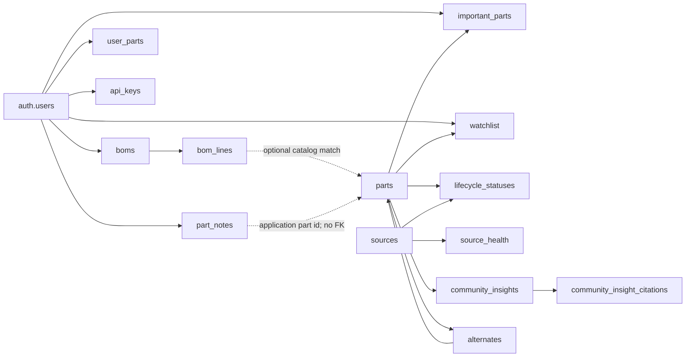

# PartPilot PostgreSQL schema

This document describes the PartPilot tables and API-facing views in the
`public` schema, plus the Supabase migration ledger. It is derived from
`supabase/migrations/0001` through `0010` and the note additions were reviewed
on 2026-08-11.

## Conventions

- Primary identifiers are UUIDs unless a table uses an integer or bigint
  sequence.
- User-owned rows reference `auth.users(id)` and are deleted when the owning
  user is deleted.
- Reference-data writes are intended for the server, worker, or service role.
- Lifecycle values are `active`, `nrnd`, `last_time_buy`, `obsolete`, or
  `unknown`.
- Compliance values are `pass`, `fail`, or `unknown`.
- Scores use the inclusive range 0–100. Confidence and similarity use 0–1.
- All timestamps are `timestamptz` and should be treated as UTC instants.
- RLS means PostgreSQL Row Level Security.

## Relationship overview

## Access model

| Category | Objects | Access behavior |
|---|---|---|
| Public reference data | `sources`, `parts`, `lifecycle_statuses`, `alternates`, `community_insights`, `community_insight_citations` | RLS is enabled with a public `SELECT` policy. Writes are expected to come from trusted server or worker roles. |
| User-owned data | `boms`, `bom_lines`, `api_keys`, `important_parts`, `part_notes`, `profiles`, `user_parts`, `watchlist` | RLS restricts rows to `auth.uid()`. `bom_lines` derives ownership through its parent `boms` row. |
| Service-internal data | `source_health` | RLS is enabled with no client policy, so normal anonymous and authenticated roles cannot access rows. |
| Migration metadata | `public.schema_migrations`, `supabase_migrations.schema_migrations` | Administrative metadata; neither deployed ledger has RLS enabled. Do not expose these through application APIs. |

## Tables

### `alternates`

Stores directed alternate-part recommendations. A relationship from A to B
does not automatically imply a relationship from B to A.

| Column | Type | Required | Default | Description |
|---|---|---:|---|---|
| `original_id` | `uuid` | Yes | — | Part being replaced; FK to `parts.id`, cascade delete. |
| `alternate_id` | `uuid` | Yes | — | Suggested replacement; FK to `parts.id`, cascade delete. |
| `match_kind` | `text` | Yes | — | Match origin: `manufacturer_cross_ref`, `form_fit_function`, or `same_family`. |
| `similarity` | `real` | Yes | — | Match strength from 0 through 1. |

- Primary key: (`original_id`, `alternate_id`).
- RLS: public read via `public read alternates`.

### `api_keys`

Stores per-user API credentials for non-browser integrations. Only a hash is
stored; raw API keys must never be persisted here.

| Column | Type | Required | Default | Description |
|---|---|---:|---|---|
| `id` | `uuid` | Yes | `gen_random_uuid()` | API-key record identifier. |
| `user_id` | `uuid` | Yes | — | Owner; FK to `auth.users.id`, cascade delete. |
| `key_hash` | `text` | Yes | — | Unique cryptographic hash of the issued key. |
| `scopes` | `text[]` | Yes | `{}` | Permissions granted to the key. |
| `created_at` | `timestamptz` | Yes | `now()` | Creation time. |

- Primary key: `id`; unique constraint: `key_hash`.
- RLS: users manage rows where `auth.uid() = user_id`.

### `bom_lines`

Stores the normalized line items belonging to a BOM project. Raw uploaded
values are retained, while optional enriched fields can override or augment
catalog data in the API view.

| Column | Type | Required | Default | Description |
|---|---|---:|---|---|
| `bom_id` | `uuid` | Yes | — | Parent BOM; FK to `boms.id`, cascade delete. |
| `line_no` | `integer` | Yes | — | Line number within the BOM. |
| `mpn_raw` | `text` | Yes | — | Manufacturer part number as uploaded or entered. |
| `manufacturer_raw` | `text` | No | — | Manufacturer as uploaded or entered. |
| `description_raw` | `text` | No | — | Description as uploaded or entered. |
| `matched_part_id` | `uuid` | No | — | Optional catalog match; FK to `parts.id`. Deleting a matched part is restricted while referenced. |
| `qty` | `integer` | Yes | `1` | Required quantity; must be greater than zero. |
| `unit_price` | `numeric(12,4)` | Yes | `0` | Stored unit price. |
| `id` | `uuid` | Yes | `gen_random_uuid()` | Stable line identifier, exposed by the API view. |
| `category` | `text` | No | — | Line-specific category override. |
| `score` | `integer` | No | — | Line-specific score override, constrained to 0–100. |
| `component_metadata` | `jsonb` | No | `null` | Optional Characteristics override containing origin, compliance, lifecycle, and other component facts. |

- Primary key: (`bom_id`, `line_no`); `id` also has a unique index.
- Index: `matched_part_id` for catalog-match lookups.
- RLS: access is allowed only when the parent BOM belongs to `auth.uid()`.

### `boms`

Represents a user-owned project or uploaded bill of materials. Detailed
component data lives in `bom_lines`.

| Column | Type | Required | Default | Description |
|---|---|---:|---|---|
| `id` | `uuid` | Yes | `gen_random_uuid()` | BOM/project identifier. |
| `user_id` | `uuid` | Yes | — | Owner; FK to `auth.users.id`, cascade delete. |
| `name` | `text` | No | — | User-facing project name. The API view falls back to `Untitled`. |
| `filename` | `text` | No | — | Original uploaded filename, when applicable. |
| `uploaded_at` | `timestamptz` | Yes | `now()` | Creation or upload time. |

- Primary key: `id`.
- Deleting a BOM cascades to its `bom_lines`.
- RLS: users manage rows where `auth.uid() = user_id`.

### `community_insight_citations`

Stores the source links supporting a part's synthesized Community Pulse
summary. One insight can have many citations.

| Column | Type | Required | Default | Description |
|---|---|---:|---|---|
| `id` | `bigserial` | Yes | Sequence | Citation identifier. |
| `part_id` | `uuid` | Yes | — | Parent insight and part; FK to `community_insights.part_id`, cascade delete. |
| `source` | `text` | Yes | — | Source platform or publication. |
| `url` | `text` | Yes | — | Citation URL. |
| `title` | `text` | Yes | — | Source title. |
| `posted_at` | `timestamptz` | No | — | Original publication time, if known. |
| `engagement` | `integer` | No | — | Source engagement signal, if available. |

- Primary key: `id`; index: `part_id`.
- RLS: public read via `public read community_insight_citations`.

### `community_insights`

Stores the latest synthesized Community Pulse digest for a catalog part. There
is at most one current digest per part.

| Column | Type | Required | Default | Description |
|---|---|---:|---|---|
| `part_id` | `uuid` | Yes | — | Primary key and FK to `parts.id`, cascade delete. |
| `summary` | `text` | No | — | Generated narrative summary. |
| `sentiment` | `text` | Yes | — | `positive`, `mixed`, `negative`, or `insufficient`. |
| `common_praise` | `jsonb` | Yes | `[]` | Generated list of recurring positive themes. |
| `common_issues` | `jsonb` | Yes | `[]` | Generated list of recurring problems. |
| `based_on_post_count` | `integer` | Yes | `0` | Number of source posts represented by the digest. |
| `generated_at` | `timestamptz` | Yes | — | Digest generation time. |

- Primary key: `part_id`.
- RLS: public read via `public read community_insights`.

### `important_parts`

Stores the current per-user Important Parts selection. Migration 0007 copied
existing `watchlist` rows into this table without deleting the legacy rows.

| Column | Type | Required | Default | Description |
|---|---|---:|---|---|
| `user_id` | `uuid` | Yes | — | Owner; FK to `auth.users.id`, cascade delete. |
| `part_id` | `uuid` | Yes | — | Important catalog part; FK to `parts.id`, cascade delete. |
| `created_at` | `timestamptz` | Yes | `now()` | Time the part was marked important. |

- Primary key: (`user_id`, `part_id`).
- RLS: users manage rows where `auth.uid() = user_id`.
- The authenticated role is granted `SELECT`, `INSERT`, `UPDATE`, and `DELETE`.

### `lifecycle_statuses`

Stores time-stamped lifecycle observations from individual data sources. The
latest observation is used by the frontend contract views.

| Column | Type | Required | Default | Description |
|---|---|---:|---|---|
| `id` | `bigserial` | Yes | Sequence | Observation identifier. |
| `part_id` | `uuid` | Yes | — | Observed part; FK to `parts.id`, cascade delete. |
| `source_id` | `integer` | Yes | — | Reporting source; FK to `sources.id`. |
| `stage` | `text` | Yes | — | Lifecycle stage. |
| `last_time_buy_date` | `date` | No | — | Last-order date when the source reports one. |
| `confidence` | `real` | Yes | — | Source confidence from 0 through 1. |
| `reported_at` | `timestamptz` | Yes | — | Time represented by the observation. |
| `raw_payload_ref` | `text` | No | — | Optional path or reference to the original evidence payload. |

- Primary key: `id`.
- Indexes: (`part_id`, `reported_at DESC`) and
  (`source_id`, `reported_at DESC`).
- RLS: public read via `public read lifecycle`.

### `part_notes`

Stores one user-owned note per application part identifier. The identifier can
belong to a catalog part, a manually entered `user_parts` row, or an unmatched
BOM part, so `part_id` deliberately has no foreign key to the shared `parts`
table.

| Column | Type | Required | Default | Description |
|---|---|---:|---|---|
| `user_id` | `uuid` | Yes | — | Note owner; FK to `auth.users.id`, cascade delete. |
| `part_id` | `uuid` | Yes | — | Application part identifier in any supported part namespace. |
| `user_note` | `text` | Yes | Empty string | User-editable note text. |
| `partpilot_points` | `jsonb` | Yes | `[]` | Reserved array of future PartPilot-generated insights. Client note updates do not overwrite it. |
| `created_at` | `timestamptz` | Yes | `now()` | Creation time. |
| `updated_at` | `timestamptz` | Yes | `now()` | Last user-note update time. |

- Primary key: (`user_id`, `part_id`).
- Check constraint: `partpilot_points` must be a JSON array.
- RLS: users manage rows where `auth.uid() = user_id`.
- The authenticated role is granted `SELECT`, `INSERT`, `UPDATE`, and `DELETE`.
- Future engine/adapter integration should update only `partpilot_points` using
  a trusted server or service-role path.

### `parts`

The canonical, shared component catalog. User-specific inventory belongs in
`user_parts`; project-specific quantities belong in `bom_lines`.

| Column | Type | Required | Default | Description |
|---|---|---:|---|---|
| `id` | `uuid` | Yes | `gen_random_uuid()` | Catalog part identifier. |
| `mpn` | `text` | Yes | — | Manufacturer part number. |
| `manufacturer` | `text` | Yes | — | Normalized manufacturer name. |
| `description` | `text` | No | `No description available` | Human-readable description. Existing blank values were normalized by migration 0007. |
| `category` | `text` | No | `Uncategorized` | Part category. |
| `component_metadata` | `jsonb` | Yes | `{}` | Canonical Characteristics document defined by [`component-cdd.schema.json`](../domain/component-cdd.schema.json). |
| `created_at` | `timestamptz` | Yes | `now()` | Catalog insertion time. |
| `score` | `integer` | Yes | `72` | PartPilot score, constrained to 0–100. |

- Primary key: `id`; unique constraint: (`mpn`, `manufacturer`).
- Search indexes: trigram GIN indexes on `mpn` and `description`, plus a B-tree
  index on `category`.
- RLS: public read via `public read parts`.

### `schema_migrations`

The deployed database contains two distinct migration ledgers.

#### `public.schema_migrations`

An application-maintained ledger recording migrations applied by filename.

| Column | Type | Required | Default | Description |
|---|---|---:|---|---|
| `version` | `text` | Yes | — | Primary key; deployed values are migration filenames. |
| `applied_at` | `timestamptz` | Yes | `now()` | Time the migration was recorded as applied. |

- Primary key: `version`; RLS is not enabled.
- At the 2026-08-08 catalog check, this ledger contained 0001–0006. Objects
  introduced by 0007 and 0008 were present in the database but were not listed
  in this ledger. Migration tracking should be reconciled before relying on it
  as the sole source of applied-version truth.

#### `supabase_migrations.schema_migrations`

Supabase CLI's internal migration ledger. It is not an application table.

| Column | Type | Required | Default | Description |
|---|---|---:|---|---|
| `version` | `text` | Yes | — | Supabase migration version; primary key. |
| `statements` | `text[]` | No | — | SQL statements recorded for the migration. |
| `name` | `text` | No | — | Optional migration name. |

- RLS is not enabled.
- This ledger was empty at the 2026-08-08 catalog check.

### `source_health`

Tracks ingestion health for each external data source so workers can detect and
report sustained failures.

| Column | Type | Required | Default | Description |
|---|---|---:|---|---|
| `source_id` | `integer` | Yes | — | Primary key and FK to `sources.id`. |
| `last_success_at` | `timestamptz` | No | — | Most recent successful ingestion time. |
| `consecutive_failures` | `integer` | Yes | `0` | Number of failures since the last success. |

- Primary key: `source_id`.
- RLS is enabled with no client policy, making this service-role/internal data.

### `sources`

Defines external lifecycle and catalog-data providers and their reconciliation
weight.

| Column | Type | Required | Default | Description |
|---|---|---:|---|---|
| `id` | `serial` | Yes | Sequence | Source identifier. |
| `name` | `text` | Yes | — | Unique source name, such as `digikey`, `mouser`, `octopart`, or `manufacturer_pcn`. |
| `trust_weight` | `real` | Yes | `0.5` | Weight used when reconciling competing observations. |

- Primary key: `id`; unique constraint: `name`.
- RLS: public read via `public read sources`.

### `user_parts`

Stores a user's manually managed inventory for the My Parts page. Component
facts use the same Characteristics document as catalog and BOM-only parts.

| Column | Type | Required | Default | Description |
|---|---|---:|---|---|
| `id` | `uuid` | Yes | `gen_random_uuid()` | User-part identifier. |
| `user_id` | `uuid` | Yes | — | Owner; FK to `auth.users.id`, cascade delete. |
| `mpn` | `text` | Yes | — | User-entered manufacturer part number. |
| `manufacturer` | `text` | Yes | — | User-entered manufacturer. |
| `description` | `text` | Yes | `Manually added part` | Description. |
| `category` | `text` | Yes | `Uncategorized` | Category. |
| `score` | `integer` | Yes | `72` | Score constrained to 0–100. |
| `component_metadata` | `jsonb` | Yes | `{}` | Canonical Characteristics document for the user-owned part. |
| `quantity` | `integer` | Yes | `1` | Inventory quantity; must be greater than zero. |
| `created_at` | `timestamptz` | Yes | `now()` | Creation time. |
| `updated_at` | `timestamptz` | Yes | `now()` | Last application-managed update time. There is no database trigger that updates it automatically. |

- Primary key: `id`.
- Unique functional index: (`user_id`, `lower(mpn)`, `lower(manufacturer)`).
- RLS: users manage rows where `auth.uid() = user_id`.
- The authenticated role is granted `SELECT`, `INSERT`, `UPDATE`, and `DELETE`.

### `watchlist`

Legacy per-user saved-part relation retained for compatibility. New Important
Parts behavior uses `important_parts`; migration 0007 copied existing watchlist
rows there.

| Column | Type | Required | Default | Description |
|---|---|---:|---|---|
| `user_id` | `uuid` | Yes | — | Owner; FK to `auth.users.id`, cascade delete. |
| `part_id` | `uuid` | Yes | — | Saved catalog part; FK to `parts.id`, cascade delete. |
| `created_at` | `timestamptz` | Yes | `now()` | Time the part was saved. |

- Primary key: (`user_id`, `part_id`).
- RLS: users manage rows where `auth.uid() = user_id`.

## API-facing views

The following are ordinary PostgreSQL views, not materialized views. Their
values are computed at query time. PostgreSQL reports view columns as nullable
in the catalog even when the view expression supplies a fallback.

### `partpilot_bom_line_api`

Produces the frontend `BomLine` shape by combining line identity/context with
optional catalog Characteristics.

| Column | Type | Derivation |
|---|---|---|
| `id` | `uuid` | `bom_lines.id`. |
| `bom_id` | `uuid` | Parent BOM identifier. |
| `part_id` | `uuid` | `matched_part_id`, otherwise the line's own `id` for a stable unmatched identifier. |
| `line_no` | `integer` | Stored line number. |
| `mpn` | `text` | Nonblank `mpn_raw`, then catalog MPN, then `UNKNOWN-{line_no}`. |
| `description` | `text` | Raw description, catalog description, then `BOM line {line_no}`. |
| `manufacturer` | `text` | Raw manufacturer, catalog manufacturer, then `Unknown`. |
| `category` | `text` | Line override, catalog value, then `Uncategorized`. |
| `qty` | `integer` | Stored quantity. |
| `unit_price` | `numeric` | Contextual BOM line price, then zero. |
| `score` | `integer` | Line override, catalog score, then 72. |
| `component_metadata` | `jsonb` | Catalog Characteristics deep-merged with the line override. |

- Granted to: `authenticated` for `SELECT`.
- Ownership caution: the view has no `user_id` predicate. Server queries should
  join or constrain through an owner-checked `boms` row.

### `partpilot_important_part_api`

Joins `important_parts` with `partpilot_part_api` to return complete catalog
details for each important-part relation.

| Column | Type | Derivation |
|---|---|---|
| `user_id` | `uuid` | Important-part owner. |
| `created_at` | `timestamptz` | Time marked important. |
| `id` | `uuid` | Catalog part ID. |
| `mpn` | `text` | Catalog MPN. |
| `manufacturer` | `text` | Catalog manufacturer. |
| `description` | `text` | Normalized description. |
| `category` | `text` | Normalized category. |
| `score` | `integer` | Catalog score. |
| `component_metadata` | `jsonb` | Catalog Characteristics, including projected latest lifecycle. |

- Granted to: `authenticated` for `SELECT`.
- Callers must filter by the authenticated `user_id`; the view definition does
  not add `auth.uid() = user_id` itself.

### `partpilot_part_api`

Produces the frontend `Part` shape from the canonical catalog. The latest
lifecycle observation is projected into `commercial.lifecycleStatus` inside
Characteristics instead of becoming a duplicate top-level field.

| Column | Type | Derivation |
|---|---|---|
| `id` | `uuid` | `parts.id`. |
| `mpn` | `text` | Catalog MPN. |
| `manufacturer` | `text` | Catalog manufacturer. |
| `description` | `text` | Nonblank description, otherwise `No description available`. |
| `category` | `text` | Nonblank category, otherwise `Uncategorized`. |
| `score` | `integer` | Catalog score. |
| `component_metadata` | `jsonb` | Canonical Characteristics document, otherwise `{}`. |

- Granted to: `anon` and `authenticated` for `SELECT`.

### `partpilot_project_api`

Produces the frontend project-card summary by aggregating BOM lines for each
project.

| Column | Type | Derivation |
|---|---|---|
| `id` | `uuid` | `boms.id`. |
| `name` | `text` | Nonblank BOM name, otherwise `Untitled`. |
| `part_count` | `integer` | Count of API-view line IDs. |
| `uploaded_at` | `timestamptz` | BOM upload/creation time. |
| `owner` | `text` | Constant display value `You`. |
| `lowest_score` | `integer` | Minimum line score, otherwise zero. |

- Granted to: `authenticated` for `SELECT`.
- Ownership caution: neither `user_id` nor an `auth.uid()` predicate is present
  in the view. Owner-scoped server queries must constrain the underlying
  `boms.user_id`.

## View security note

The deployed views do not set the PostgreSQL `security_invoker` option. Because
owner-specific views also omit an `auth.uid()` predicate, they should be
accessed through PartPilot's owner-scoped server endpoints rather than queried
unfiltered from a client. If direct Supabase Data API access is required, revise
the views to use invoker security and explicit owner filtering, then test the
effective RLS behavior.

## Source migrations

| Migration | Main schema changes |
|---|---|
| `0001_init_core_schema.sql` | Extensions, `sources`, `parts`, `lifecycle_statuses`. |
| `0002_user_data_and_alternates.sql` | `alternates`, `watchlist`, `boms`, `bom_lines`, `api_keys`, `source_health`. |
| `0003_rls_policies.sql` | Initial public-read and owner-scoped RLS policies. |
| `0004_bom_line_qty_price.sql` | BOM quantity and unit price. |
| `0005_compliance_and_origin.sql` | Part origin and `part_compliance`. |
| `0006_community_insights.sql` | Community insights and citations. |
| `0007_frontend_contract_views.sql` | Frontend fields, important parts, and four API views. |
| `0008_user_parts_crud.sql` | Server-backed manual inventory in `user_parts`. |
| `0009_user_profiles.sql` | User profile fields managed from Settings. |
| `0010_part_notes.sql` | User-owned part notes and reserved PartPilot insight points. |
| `0011_part_categories.sql` | Enforces category on catalog, manual, and BOM part records. |
| `0012_component_cdd_metadata.sql` | Introduces the shared Characteristics document. |
| `0013_consolidate_component_characteristics.sql` | Backfills Characteristics, removes redundant legacy columns and `part_compliance`, and rebuilds API views. |
